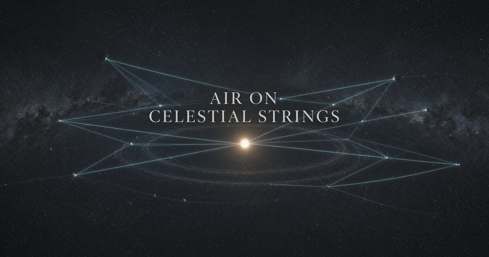

<p align="center">
  
</p>

<h1 align="center">Air on Celestial Strings</h1>

<p align="center">
  A living orrery. Music weaves glowing strings between the worlds.
</p>

<p align="center">
  Made by <a href="https://x.com/njmarko">Marko Njegomir</a> with Grok
</p>

<p align="center">
App available at this link: https://air-on-celestial-string.grok.me/
</p>

---

## Preview

<p align="center">
  
</p>

---

## What it is

Pick a public-domain recording — Strauss, Mozart, Bach, Beethoven — or add your own. Bass, mids, and treble stretch luminous trails between planets as they orbit. Auto mix reads the piece in sections so the left hand and the melody can weave independently.

Default first string: **Venus · Earth**, listening to the whole mix.

## Try

- Click two worlds, then **Weave**
- Space plays and pauses the recording
- H hides the chrome
- Hover any control for a hint
- Export an MP4 of the sky and the music (menus stay out of the file)
- Circle camera slowly orbits the sun while you record

## Languages

English is the default. Serbian (Cyrillic) ships beside it — flags sit next to each option, and the choice is remembered on this device.

### Add a language

1. Copy [`src/i18n/locales/en.ts`](src/i18n/locales/en.ts) to `src/i18n/locales/<id>.ts` and translate every key. TypeScript will fail the build if a string is missing.
2. Open [`src/i18n/catalog.ts`](src/i18n/catalog.ts) and append one row to `LANGUAGES`:

```ts
{ id: "fr", htmlLang: "fr", nativeName: "Français", flag: "fr", messages: fr },
```

3. If you need a new flag, add a `FlagCode` and a drawing in [`src/i18n/flags.tsx`](src/i18n/flags.tsx).

Hints, panels, tracks, planet names, mix-section voices, export copy, and error text all read from the same catalog.

## Maps and music

- Planet maps: [Solar System Scope](https://www.solarsystemscope.com/textures/), CC BY 4.0. 2K ships with the app; the highest published size downloads on first visit and is cached on the device.
- Recordings: Musopen, Advent Chamber Orchestra, U.S. Air Force Band — public domain / Creative Commons. See [`public/audio/ATTRIBUTION.txt`](public/audio/ATTRIBUTION.txt).

## Stack

TanStack Start, React 19, three.js, Tailwind. No account, no database — everything stays on the device.
